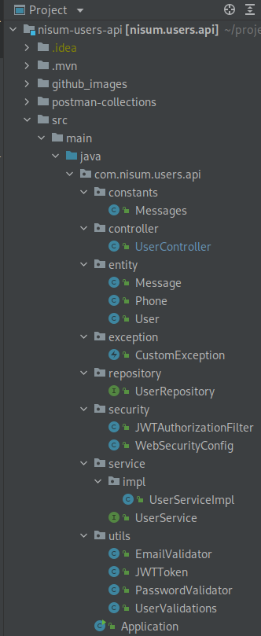
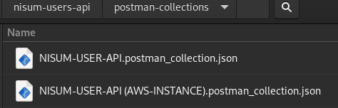

# Prueba Técnica Java para NISUM - API RESTful de creación de usuarios.
### Autor: Erick Ocando - Fecha: 12/2021
#### Última actualización: 28 dic 2021

### Tecnologías

- Java 11
- Spring Boot - version 2.6.2
- JPA
- Hibernate
- H2
- Maven
- Autenticación con Token JWT
- Pruebas Unitarias con Junit, Mockito y Jacoco
- Docker
- AWS

### Funcionalidades

1. Funcionalidad Crear Usuario y retorno de token de la sesión
2. Funcionalidad Consultar Usuario y recibir información: 
   1. Id
   2. Fecha creación
   3. Fecha actualización
   4. Token sesión
   5. Teléfonos
   6. Entre otras
3. Validación y restricción si el correo a registrar ya existe
4. Validación y restricción expresión regular para registro de correos (aaaaaaa@dominio.cl)
5. Validación y restricción expresión regular en la contraseña para validar formato correcto
6. Persistencia del token junto a la información del Usuario
7. Formato en los mensajes: {"mensaje": "mensaje de error"}
8. Ejecución con maven o con Docker
9. Pruebas unitarias con junit, mockito y reportes en jacoco


### Diagrama Autenticación empleado (Usando token JWT)


### Estructura Proyecto


### Ejecución de la Aplicación
#### Ejecución con maven y Java (Necesario maven y java 11 instalados) 

- clonar el proyecto ```$ git clone https://github.com/eocandos/nisum-users-api.git```
- Ir al directorio del proyecto
```$ cd nisum-users-api/ ``` 
- Generar jar del proyecto
```$ mvn clean && mvn install ```
- Correr proyecto con Maven ```$ mvn spring-boot:run  ```
- O con java ```$ java -jar target/nisum.users.api-0.0.1-SNAPSHOT.jar ```

#### Ejecución con Docker (Necesario docker instalado)

- clonar el proyecto ```$ git clone https://github.com/eocandos/nisum-users-api.git ```
- Ir al directorio del proyecto
  ```$ cd nisum-users-api/ ```
- Generar jar del proyecto ```$ mvn clean && mvn install ```
- Crear imagen ```$ docker build -t nisum-users-api:v0.1 . ``` *Si es un sistema operativo linux a lo mejor deba 
ejecutar este comando como administrador, es decir, con sudo ```$ sudo docker build -t nisum-users-api:v0.1 .```
- Ejecutar imagen creada  ```$ sudo docker run -p 8080:8080 nisum-users-api:v0.1 ``` 

### Realizar Peticiones con Postman

#### Importar colección en Postman

- Dentro de la carpeta postman-collections encontraremos las colecciones de postman para realizar las peticiones a la api


- Abrimos postman y en archivos/importar importamos la colección que queramos: 
- Probar la app en local o apuntarle a una instancia de AWS
- Luego de importar las colecciones procedemos a realizar peticiones a la API:

#### En local

- Crear Usuario | Abrimos el endpoint en la colección para crear un nuevo usuario y 
tomamos el token que nos regresa la API luego de la autenticación para proceder con las siguientes peticiones

- Obtener usuarios | Abrimos el endpoint para obtener los usuarios registrados y establecemos el tipo de Autenticación de la solicitud (Barer token en este caso) empleando el token que nos entregó la API

- Realizamos la petición de obtener una lista de todos los usuarios registrados desde el más antiguo registrado hasta el más reciente

- Validación y restricción si el correo a registrar ya existe

- Validación y restricción expresión regular para registro de correos (aaaaaaa@dominio.cl)

- Validación y restricción expresión regular en la contraseña para validar formato correcto

- Funcionalidad adicional actualizar Usuario


#### Instancia AWS

Como adición se muestra la API corriendo en una instancia de EC2 de AWS para usarla como ambiente de pruebas

Podemos realizar las mismas peticiones pero ahora usando la otra colección que está en la misma carpeta (postman-collections) pero la que se llama NISUM-USER-API (AWS-INSTANCE)
- Crear Usuario

- Obtener Usuarios registrados (No olvidemos tomar el token activo e incluirlo en las cabeceras de la petición)


#### Pruebas Unitarias

Para generar el reporte podemos ejecutar el comando ```$ mvn clean site ``` el cual generará con jacoco el reporte que
se muestra a continuación en el directorio del proyecto raiz/targe/site/jacoco que podemos abrir ejecutando el archivo
index.html


Podemos observar el resumen de las pruebas


Y una vista de la cobertura realizada en la clase UserController


Aún faltan pruebas pero se deja la base para su posible continuación

